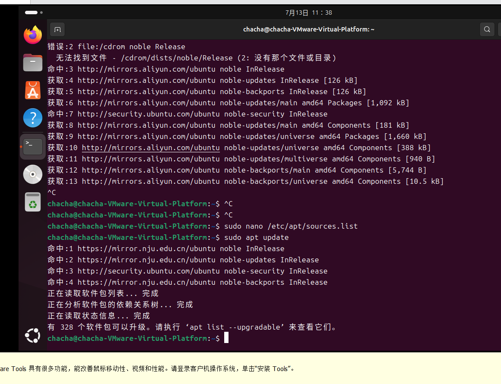
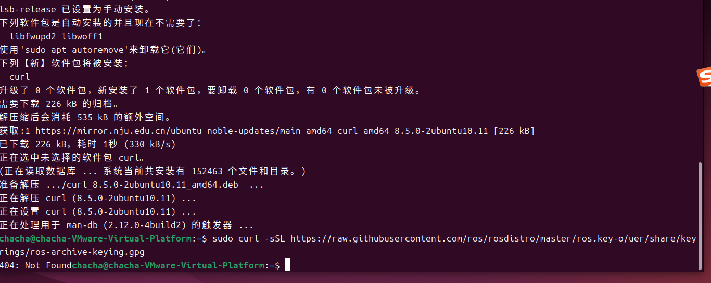

# 
DAY 1

**记录人：江栩**
**记录时间：2026.7.13**
## 一.学习内容
### 1.1ROS2环境配置
 + 跟随教程一步一步配置Ubuntu虚拟机环境，调试ROS2，运行talker测试程序
 + 在虚拟机只能怪安装好VScode,装好Python，c语言配套插件，并编码运行简单代码
### 1.2Markdown功能学习
 + 标题：使用#，几级标题及使用几个#，作用于加粗
>在使用中注意#与文字之间要有空格
 + 文本样式与表格
   |效果|符号|案例
   |:--|:-:|:--:|
   |加粗|**|**加粗**|
   |斜体|*|*斜体*|
   |删除|~~|~~删除~~|
   >注意使用文本样式使用形式** **
   >>表格中的：要使用英文
 + 列表：分为无序，有序列表与任务列表
       无序：
        -第一项      
           -（空两格）第一项的子项
       有序：
       1.第一
       1.第二
       任务列表：
       - [x] a
       - [ ] b
 + 链接与图片
   链接：
   [ROS2环境配置教程](https://blog.csdn.net/m0_58575732/article/details/158773613?spm=1001.2014.3001.5501)   
   图片：

 + 行内代码:展示代码文字
  >使用`符号

 `printf("hello");`
 

## 二.遇到问题
### 2.1ROS2环境配置
+ 系统自带apt源包含cdrom光盘源，更新时提示找不到cdrom文件
 
>apt update过程反复打印 无法找到文件 - /cdrom/dists/noble/Release ，拖慢更新速度。
解决办法
1. 编辑系统主源文件：
bash
sudo nano /etc/apt/sources.list
2. 将文件内所有以 deb file:/cdrom 开头的行，在行首添加 # 注释掉
3. 保存退出（Ctrl+O回车，Ctrl+X），再次执行 sudo apt update ，cdrom报错消失。
+ 下载ROS密钥链接404 Not Found
  
  > 密钥下载失败后照常配置软件源，长命令粘贴时字符出错，ROS的源配置文件语法破损，apt更新解析失败。
### 2.2markdown
+ 中英文没规范区分、空格乱加/漏加
  >产生影响
 排版观感杂乱；复制Markdown里的终端命令时，多余/缺失空格会改变指令含义，触发ROS密钥下载、apt源配置报错
修正做法
1. 中文和英文、数字中间统一加1个空格，例：安装 ROS2、版本 8.5.0
2. 中文标点两侧不加空格；Markdown标题 # 、列表 - 符号后空一格再写正文
3. 删掉无意义的多余空白换行
 
+ 拼写出错、字符没法正常保存渲染
  >产生影响
单词、参数拼写偏差，Markdown预览样式错乱；复制到Ubuntu终端执行直接报404、源格式语法错误
修正做法
1. 代码命令拒绝手动打字，整段复制；用 bash 包裹代码块，锁住特殊字符不被转义破坏
2. 括号、方括号、引号先成对补齐，再填充内部文字，避免半边符号漏写
 
+ $、[] 这类特殊符号格式异常
  >产生影响
apt源配置里 arch=$(dpkg --print-architecture) 这类表达式被解析损坏，apt更新抛出 [option] not assignment 报错
修正做法
所有终端代码放进独立代码块；正文里引用代码片段，用单行反引号  `  包裹
### 三.学习心得
   本次实操让我明白，使用教程指令需先核对链接有效性、分步处理前置报错避免连锁故障，书写Markdown文档要规范中英文空格、妥善保护特殊符号并分段调试，做事不能盲目照搬、一次性完工，要及时校验排查问题。