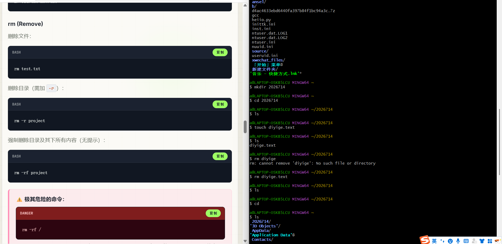
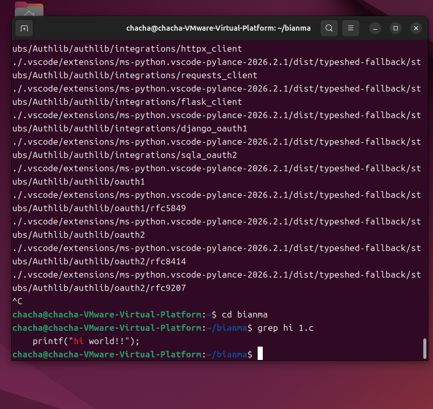
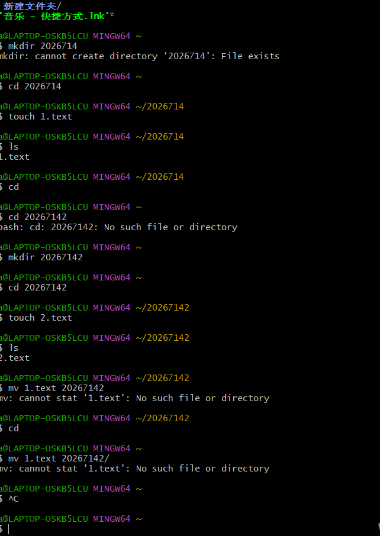
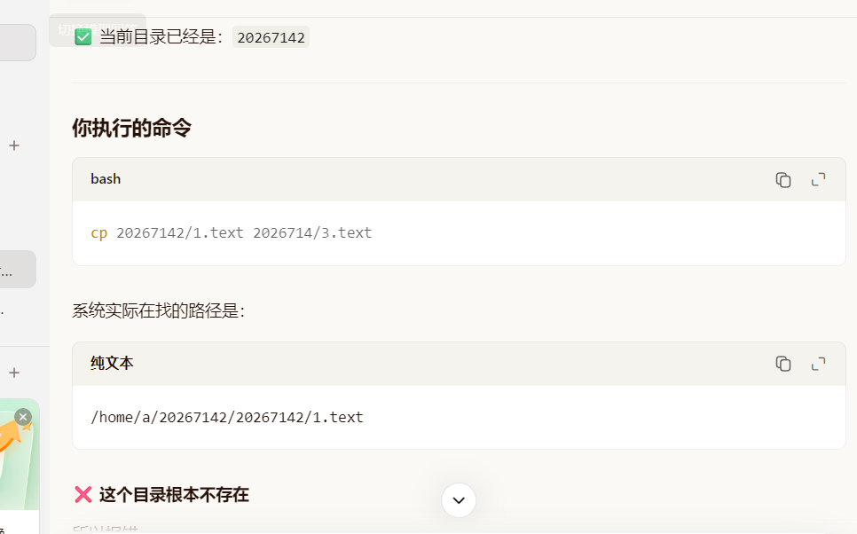

# 
DAY 2
**记录人:江栩**
**记录时间：2026.7.14**
## 一.学习内容
### 1.1linux学习
常用格式：命令 [选项] [参数]
+ |命令|可搭配选项|作用|
  |:---|:---------:|---:|
  |ls|-a,-h,-l|查找|
  |cd|..,~|切换目录|
  |mkdir|-p|创建目录|
  |touch|无|创建文件|
  |cat|无|查看全部内容|
  |less|无|分页查看|
  |cp|-r|复制|
  |mv|无|移动与重命名|
  |rm|-r|删除 |
+ 补充：
    - cd..返回上级，cd~返回根目录
    - mkdir -p可连续创建目录
    - cp -r才可以移动目录
    - rm -r才可以删除目录
    -  -r递归处理
    -  使用mv时注意当前所处目录
+ 高级： 
    - 搜索文件
     >find . -name "*.txt"
     查找当前目录及子目录中以.txt结尾的文件
  
    - 搜索内容
     > grep hello test.txt
     查找test.txt中含有hello的文本行

     - 查看系统信息
   >whoami(用户名)
    date（当前日期时间

     - 软件安装（Ubuntu）
    >sudo apt install git 安装指定软件
    sudo apt remove git 删除指定软件
    sudo apt update 更新本地包索引软件源
     sudo apt upgrade升级所有已安装的软件包到最新版本
    - 重定向与管道
     >'>'(命令->文件)j将命令结果写进文件里，将原先内容取代
     '>>'(命令->文件)j将命令结果写进文件后面不会覆盖
    '|'(命令->命令)将前一个命令的输出结果，作为下一个命令的输入来处理
+ 相对与绝对路径
     -   绝对路径
        从根目录开始的完整路径
        /home/user/documents/file.txt
     - 相对路径
       相对于你当前所在目录的路径
       写法	实际指向
       >  ..表示上一级
          .表示当前
    :|
+ 常见选项
  |选项|作用|
  |:---|---:|
  |-a|显示所有（含隐藏）|
  |-l|长格式显示|
  |-h|人类可读大小|
  |-r|递归处理|
  |-f|强制，不提示|
  |-i|​交互确认|
  |-p|创建父目录|
+ 运行案例
  

## 二.遇到问题
### 2.1
cp复制文件时找不到文件

### 2.2
find搜索文件不成功
>命令、选项、参数之间要有空格！！！
## 三.心得
今天是我真正意义上“上手”Linux的一天，不再是停留在“听说过”，而是实实在在地在命令行里踩坑、纠错、理解原理。回头一看，最大的收获不是记住了多少命令，而是开始用“系统的眼光”看命令行。
### 3.1最大的认知转变：命令不是“咒语”
以前我以为，Linux命令是靠死记硬背的，背不住就查。但今天我发现：命令是有逻辑的，报错是有原因的。
比如我最开始犯的错误：
把 find . -name写成 find .name
把 find . -name写成 find.-name"*.c"
系统报的错看似莫名其妙，但当我理解了“空格是分隔符”、“横杠 -是选项标志”之后，一切都通顺了。原来系统不是在刁难我，而是在严格执行规则。
### 3.2搞懂了三个“核心概念
今天有三个瞬间，我感觉脑子里的灯亮了：
1. 路径与当前目录（pwd / cd）
我终于明白了为什么之前 mv 1.text 20267142总是失败——我以为我在家目录，其实我在子目录里。
pwd不是多余的，它是定位器。
./是当前目录，../是上一级目录。
2. 重定向 >与管道 |
这是我今天觉得最精彩的部分。
重定向 (>)：是“接水桶”。把本来要喷到屏幕上的水，引到文件里。它涉及磁盘，会覆盖。
管道 (|)：是“接水管”。把前一个命令的输出，直接变成后一个命令的输入。它只在内存里流动，不碰磁盘。
以前我觉得它们很像，现在我知道：一个存文件，一个连命令，完全不同。
3. 引号的“真伪”
今天我认识了 ' '和 ‘ ’的区别。
键盘打出来的 '是 ASCII 字符，Shell 认。
从网页复制过来的 ‘是 Unicode 字符，Shell 不认。
这解释了为什么很多复制粘贴的命令会报错。​ 以后我再也不敢随便从 Word 或网页里复制命令了
### 3.3关于选项的感悟：-r、-a 到底是什么？
今天我查了 -r和 -a，发现它们在不同的命令里意思不一样。
在 rm里，-r是 Recursive（递归）。
在 cp里，-a是 Archive（归档）。
在 ls里，-a是 All（全部）。