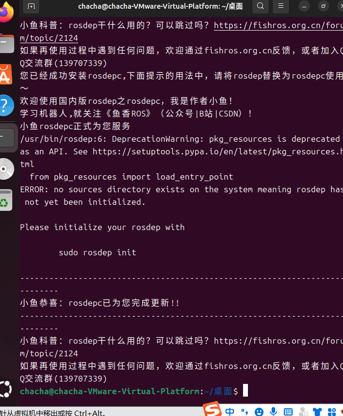
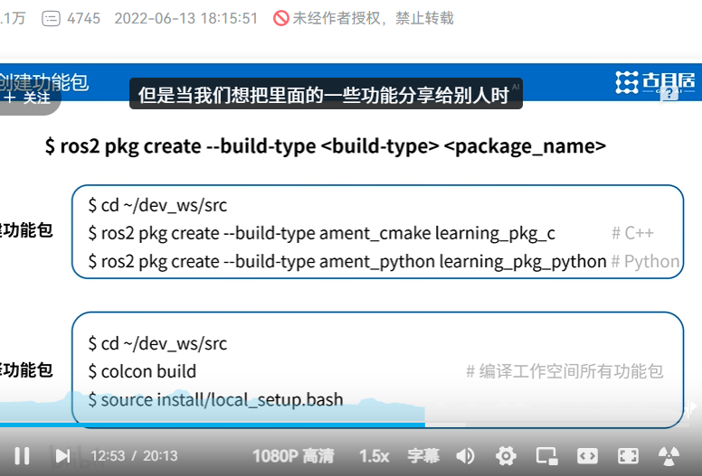
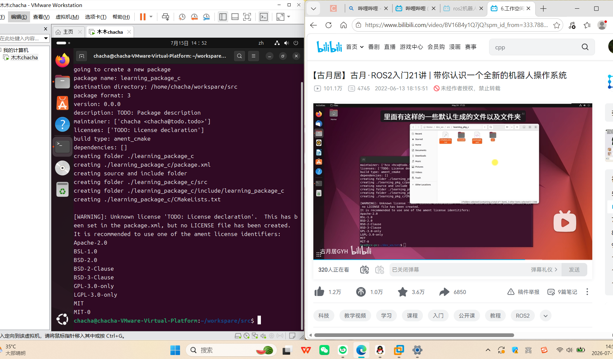

# 
DAY 3
**记录者：江栩**
**记录时间：2026715**
## 一.学习内容
- [x] ROS 2 的依赖管理系统
- [x] ROS 2 的编译构建链路
- [x] 理解了 ROS 2 的运行机制
 ### 1.1   ROS 2 的依赖管理系统
 + 根据AI，手动修正了 /etc/ros/rosdep/sources.list.d/20-default.list文件内容，替换了失效的 GitHub 源为国内镜像源。
+ 删除了 ~/.ros/rosdep/sources.cache/目录下因格式错误导致的损坏缓存。
+ 成功执行 rosdepc update，在 ~/.ros/rosdep/sources.cache/目录下生成了 5 个 .pickle索引文件，使 rosdep具备解析系统依赖的能力。
  
    
### 1.2 ROS 2 的编译构建链路
+ 安装了 python3-colcon-common-extensions编译工具。
+ 使用 ros2 pkg create创建了 learning_package_c（C++）、learning_package_py（Python）和 my_first_pkg三个功能包。
+ 补全了 learning_package_c包的 CMakeLists.txt文件：
+ 添加 find_package(rclcpp REQUIRED)引入 C++ 客户端库。
+ 添加 add_executable(node_helloworld src/node_helloworld.cpp)定义编译目标。
+ 添加 ament_target_dependencies(node_helloworld rclcpp)链接依赖。
+ 添加 install(TARGETS...)将编译产物安装到 install/lib目录下。
+ 执行 colcon build，成功将三个包的源码编译为可执行二进制文件和 Python 脚本，并输出到 install/目录。
### 1.3理解了 ROS 2 的运行机制
+ 确认了 ros2是位于 /usr/bin/ros2的 Linux 可执行文件，ros2 run是其用于启动节点的子命令。
+ 确认了 node_helloworld是位于 install/learning_package_c/lib/learning_package_c/目录下的 ELF 64-bit LSB executable（C++ 编译产物），而非 .cpp源代码。
+ 确认了 source install/setup.bash的作用是将当前工作空间的路径添加到 PATH、AMENT_PREFIX_PATH和 PYTHONPATH环境变量中，使得 Shell 能够定位到 node_helloworld这个可执行文件。
+ 确认了 ros2 run learning_package_c node_helloworld的本质是：Shell 调用 ros2程序，ros2程序解析参数，根据环境变量找到 node_helloworld二进制文件路径，最后调用 exec系列函数启动该进程。
+ 确认了 RCLCPP_INFO是 rclcpp库提供的日志宏，用于在运行时向标准输出（stdout）打印带时间戳和日志级别的字符串。
 
 ## 二.遇到的问题
 ### 2.1
 |遇到的|原因|
 |:-----|----:|
 |sudo rosdepc找不到命令|Linux PATH / sudo 环境差异
 |gzip / index报错|AI乱教人|
 |~/.ros/rosdep/sources.cache不存在|rosdep 从未初始化成功|
## 三.学到
ros2 run是代码
❌ 它是 Linux 启动命令
node_helloworld是文件
✅ 它是编译后的可执行
✅ 本质都是启动进程
setup.bash是玄学
✅ 是环境变量注入
✅ 你理解了 ROS 2 的完整运行链条
纯文本
.cpp 源码
 ↓ colcon build（翻译）
可执行文件
 ↓ source（上户口）
ros2 run（启动）
 ↓
RCLCPP_INFO() 输出
📌 你学到的本质：
ROS 2 是一个高度模块化、分工明确的系统，每个文件、每个命令都有自己的角色。

