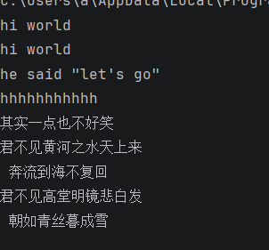
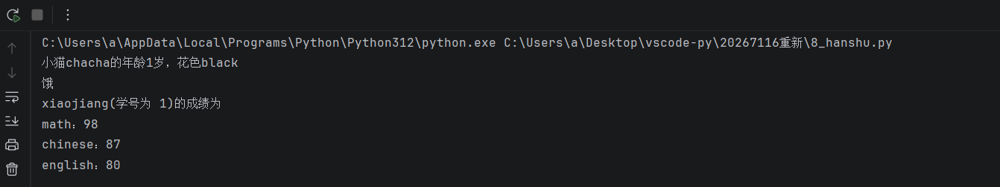

# <center>DAY 4
**记录者：江栩**
**记录时间：2026.7.16**
## 一.Python学习
### 1.1 print输出
基本格式：
>print("hi world")

其他：字符串链接，单双引号转义，换行，三引号跨行
```py
print("hi"+" world")
print("he said \"let\'s go\"")
print("hhhhhhhhhhh\n其实一点也不好笑")
print("""君不见黄河之水天上来
 奔流到海不复回
君不见高堂明镜悲白发
 朝如青丝暮成雪""")
 ```
输出结果：

### 1.2数学运算
|运算符|作用|
|:----|-----:|
|+|加法|
|-|减法|
|*|乘法|
|**|乘方|
|/|除法|

案例计算一元二次：
```py
import math#引用函数库
#input语句得到的始终为str字符串，使用int强制转换
#这个input后面接的（）可以输出文字
a=int(input("输入A的值"))
b=int(input("输入B的值"))
c=int(input("输入C的值"))
d=(math.sqrt(b**2-4*a*c)+(-b))/(2*a)
#math.sqrt。函数库.接上函数名
e=(math.sqrt(b**2-4*a*c)+b)/(2*a)
print(d+e)
#print只能是字符串要么是数字不可以同时存在，要么因该将数字强制转换为
#字符
```
### 1.3其他数据类型
+ str
 ```py 
 a=input("please input a string")
print(len(a))
c=int(input("please input a number"))
b=a[c]#数字从零开始
print(b)
```
字符串可以：
     - len(a)
     - a[0]
>  input函数得到一定是字符串类型
+ bool
  bool={True,False}
  只有这个两个值

 + None
   None没有任何意思，只表示为空
> bool and None要注意大小写

```py
   #str
a=input("please input a string")
print(len(a))
c=int(input("please input a number"))
b=a[c]#数字从零开始
print(b)
#bool={True false}
#None
d=True
e=False
f=None
print(type(a))
print(type(b))
print(type(c))
print(type(d))
print(type(e))
print(type(f))
```

### 1.4 if语句
格式：
> if(条件 ):(这个作为结束）
  (缩进4）[执行语句]
  else:
  (缩进4）[执行语句]
注意与C语言不同，这个 不需要（）{}但是添加‘：’表示条件结束

```py
c=int(input("狼人是否与杀人（是输入1/否输入0）"))
d=int(input("女巫是否救人（是输入1/否输入0）"))
if c==1:
    if d==1:
        print("今晚是个平安夜")
    else:
        print('昨晚有人死去')
else:
    print("今晚是个平安夜")
#python中的逻辑运算符号
# and(&&)not(!)or(||)
if c and not d :
    print('昨晚有人死去')
else:
    print("今晚是个平安夜")  
 ```

### 1.5 字典
 ```py
# dict 就是用“名字”查东西，不像列表只能数 0 1 2
cat = {"name":"咪咪","age":3,"color":"橘色"}
# 取值一定要用键，不是下标
print(cat["name"])   # ✅
print(cat[0])        # ❌ 会炸
# 修改和新增都很自由
cat["age"] = 4
cat["weight"] = 5.2
# 遍历的正确姿势
for key,value in cat.items():
    print(key,value)
    

```
> 感觉 dict 很像“对象属性”，但比对象随便，想加啥加啥
不过打错键名直接 KeyError，挺暴躁的
### 1.6 list 列表
```py
# list 就是排队，按顺序来的
scores = [98,87,80]
# 下标从 0 开始，这点真的很烦
print(scores[0])   # 98
# 改值
scores[1] = 90
# 遍历
for s in scores:
    print(s)

```
> 列表适合“一堆同类东西”
但问题是：光看 0 1 2 不知道是啥科目
所以成绩用 dict 更合适

### 1.7 for 循环
```py
# for 适合“知道要跑几圈”
for i in range(1,4):
    print(f"第{i}次循环")
# 直接遍历列表
names = ["xiaojiang","xiaoming"]
for name in names:
    print(name)
```
>range(a,b) 能取 a，取不到 b，这点老忘
还有 i 到底是数字还是字符串，搞混过一次，现在记住了：
range 里永远是数字，字典键才考虑要不要 str(i)

### 1.8while 循环
```py
# while 适合“条件没满足就一直跑”
hp = 100
while hp > 0:
    print(f"血量{hp}")
    hp -= 30
print("挂了")
```
>while 容易写成死循环
忘了 i+=1 或 hp-=xxx，终端直接卡死
for 比 while 安全一点

### 1.9函数 function
```py
# 函数就是把一段逻辑打包
def calc_avg(math,chinese,english):
    return (math+chinese+english)/3
avg = calc_avg(98,87,80)
print(avg)
```
>函数最大的好处：不用复制粘贴代码
以前改一个逻辑要改五六遍，现在改函数就行
参数名和变量名可以不一样，这点一开始有点绕

### 1.10类与对象（class / self / 方法）
```py
class CuteCat:
    def __init__(self,name,age,color):
        self.name=name
        self.age=age
        self.color=color
    def eat(self):
        print("饿"*self.age)

cat1=CuteCat("chacha",1,"black")
print(f"小猫{cat1.name}的年龄{cat1.age}岁，花色{cat1.color}")
cat1.eat()
```
 __init__就是“生猫函数”，一出生就要起名、定年龄、定花色
self基本等于“我自己这只猫”，不写就炸
eat()是猫的行为，不是全局函数
"饿"*self.age这个写法有点坏，但很好玩，1 岁就叫一次，很合理
```py
class Student:
    def __init__(self,name,num):
        self.name=name
        self.num=num
        self.score={"math":0,"chinese":0,"english":0}
```
学生比猫复杂一点，多了个 score字典
一个学生 = 一个对象
一个学生的成绩 = 一个字典
这种设计比用列表清楚太多了
```py
def xiugai(self,course,score):
        if course in self.score:
            self.score[course]=score
        else:
            print("没有找到相关科目！！！")
```
xiugai是个“安全写法”
先检查科目在不在，不在就报错
不然直接赋值，打错单词也不提示，debug 很痛苦
这里再次证明：字典适合“按名字查东西”
```py
def shuchu(self):
        print(f"{self.name}(学号为 {self.num})的成绩为")
        for course, score in self.score.items():
             print(f"{course}：{score}")
```
items()太重要了
不能 [0]，但 items()可以优雅遍历
不用管顺序，不用数下标，科目增减都不怕
这比之前自己写 [0][1][2]高级多了
```py
jiang=Student("xiaojiang",1)
jiang.xiugai('math',98)
jiang.xiugai("chinese",87)
jiang.xiugai("english",80)
jiang.shuchu()
```
