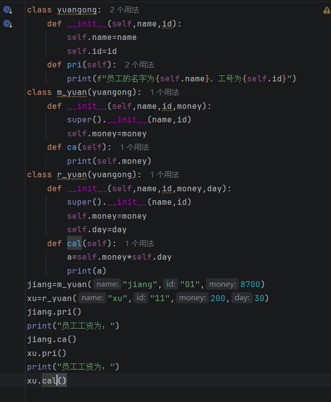
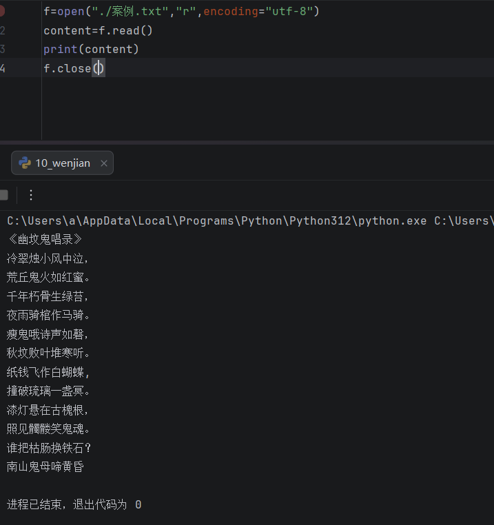
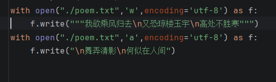
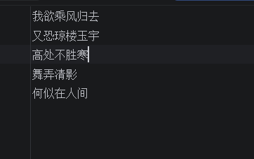
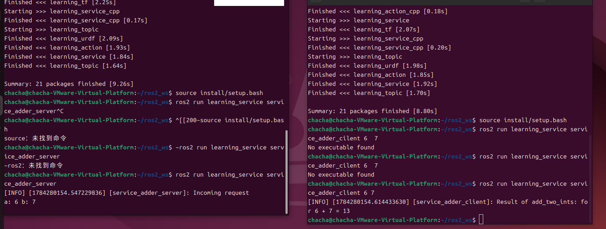

# <center>DAY 4
**记录者：江栩**
**记录时间：2026.7.16**
#### 今日学习内容
- [x] python继承
- [x] Python文件读写
- [x] python try捕捉bug
- [x] 话题（Topic）
- [x] 服务（Service
## 一.学习内容
### 1.1 python继承
> A是B,表示A可以有B表示
+ 先创建class 父类
+ 明确父类共有的性质和方法
> 比如 员工分为正式员工与日结员工
> 员工是父类
```py  
class yuangong:
    def __init__(self,name,id):
        self.name=name
        self.id=id
    def pri(self):
        print(f"员工的名字为{self.name}，工号为{self.id}")
```
>定义员工有姓名与ID等共有性质，但是正式员工和日结员工的工资（性质）不同，可以对应的类进行添加，防止麻烦可以使用super函数
+ 定义子类的性质
```py 
class m_yuan(yuangong):
    def __init__(self,name,id,money):
        super().__init__(name,id)
        self.money=money
    def ca(self):
        print(self.money)
class r_yuan(yuangong):
    def __init__(self,name,id,money,day):
        super().__init__(name,id)
        self.money=money
        self.day=day
    def cal(self):
        a=self.money*self.day
        print(a)
```
> super 这个函数可以跳转到yungong里
> 注意!!!子类时注意class m_yuan(yuangong)，括号里面是 父类
+          
```py
jiang=m_yuan("jiang","01",8700)
xu=r_yuan("xu","11",200,30)
jiang.pri()
print("员工工资为：")
jiang.ca()
xu.pri()
print("员工工资为：")
xu.cal()
```
**案例**

**结果**

### 1.2 Python文件读写
+ 文件要被使用就必须使用 open这个函数
+ 格式：open("路径"，"方式"，encoding="utf-8")  
 
|符号|作用|
|:---|---:|
|r|只读模式，不可以修改（若遇到路径上没有的文件会报错）|
|w|只写模式，可以修改，但是修改内容会覆盖原先内容（若遇到路径上没有的文件会生成文件）|
|a|可读可写，添加的内容会在原文件后面添加|


+ 
 |内容|含义|
 |:---|---:|
 |f.read()|阅读全部文本|
 |f.read(num)|会阅读第num个字节 |
 |f.readline()|会阅读一行|
 |f.readlines()|返回全部文件内容组成的列表|


案例：



### 1.3 bug捕捉
***格式：***
try:
> 接上可能会出错的代码
 
except(**可能会出现的错误❌️**) ：
>这后面接上如果出错执行的语句
 >>如果不知道出什么错误就使用except:
 概括所有问题

else:
>如果不发生问题执行的语句

finally:
>无论怎么样都会执行的语句


### 1.4话题（Topic）——单向、广播式互动
话题的关键词:
> 发布/订阅模型，一对多，无回应，异步通信
> 
|角色|行为|
|:---|---:| 
|pub(发布者)|定期发布信息|
|sub(订阅者)|订阅后就被动接受信息|
```py
#!/usr/bin/env python3
# -*- coding: utf-8 -*-
"""
@作者: 古月居(www.guyuehome.com)
@说明: ROS2话题示例-发布“Hello World”话题
"""
import rclpy                                     # ROS2 Python接口库
from rclpy.node import Node                      # ROS2 节点类
from std_msgs.msg import String                  # 字符串消息类型
"""
创建一个发布者节点
"""
class PublisherNode(Node):
    
    def __init__(self, name):
        super().__init__(name)                                    # ROS2节点父类初始化
        self.pub = self.create_publisher(String, "chatter", 10)   # 创建发布者对象（消息类型、话题名、队列长度）
        self.timer = self.create_timer(0.5, self.timer_callback)  # 创建一个定时器（单位为秒的周期，定时执行的回调函数）
        
    def timer_callback(self):                                     # 创建定时器周期执行的回调函数
        msg = String()                                            # 创建一个String类型的消息对象
        msg.data = 'Hello World'                                  # 填充消息对象中的消息数据
        self.pub.publish(msg)                                     # 发布话题消息
        self.get_logger().info('Publishing: "%s"' % msg.data)     # 输出日志信息，提示已经完成话题发布
        
def main(args=None):                                 # ROS2节点主入口main函数
    rclpy.init(args=args)                            # ROS2 Python接口初始化
    node = PublisherNode("topic_helloworld_pub")     # 创建ROS2节点对象并进行初始化
    rclpy.spin(node)                                 # 循环等待ROS2退出
    node.destroy_node()                              # 销毁节点对象
    rclpy.shutdown()                                 # 关闭ROS2 Python接口
```
```py
#!/usr/bin/env python3
# -*- coding: utf-8 -*-

"""
@作者: 古月居(www.guyuehome.com)
@说明: ROS2话题示例-订阅“Hello World”话题消息
"""

import rclpy                                     # ROS2 Python接口库
from rclpy.node   import Node                    # ROS2 节点类
from std_msgs.msg import String                  # ROS2标准定义的String消息

"""
创建一个订阅者节点
"""
class SubscriberNode(Node):
    
    def __init__(self, name):
        super().__init__(name)                                    # ROS2节点父类初始化
        self.sub = self.create_subscription(\
            String, "chatter", self.listener_callback, 10)        # 创建订阅者对象（消息类型、话题名、订阅者回调函数、队列长度）

    def listener_callback(self, msg):                             # 创建回调函数，执行收到话题消息后对数据的处理
        self.get_logger().info('I heard: "%s"' % msg.data)        # 输出日志信息，提示订阅收到的话题消息
        
def main(args=None):                                 # ROS2节点主入口main函数
    rclpy.init(args=args)                            # ROS2 Python接口初始化
    node = SubscriberNode("topic_helloworld_sub")    # 创建ROS2节点对象并进行初始化
    rclpy.spin(node)                                 # 循环等待ROS2退出
    node.destroy_node()                              # 销毁节点对象
    rclpy.shutdown()
 ```


### 1.5服务（Service）——双向、问答式互动
服务关键词：
> 请求 / 响应、一对一、同步语义但异步实现

|角色|行为|
|:---|---:|
|cLient|主动发起请求|
|server|被动处理请求|
```py
#!/usr/bin/env python3
# -*- coding: utf-8 -*-

"""
@作者: 古月居(www.guyuehome.com)
@说明: ROS2服务示例-发送两个加数，请求加法器计算
"""

import sys

import rclpy                                                                      # ROS2 Python接口库
from rclpy.node   import Node                                                     # ROS2 节点类
from learning_interface.srv import AddTwoInts                                     # 自定义的服务接口

class adderClient(Node):
    def __init__(self, name):
        super().__init__(name)                                                    # ROS2节点父类初始化
        self.client = self.create_client(AddTwoInts, 'add_two_ints')              # 创建服务客户端对象（服务接口类型，服务名）
        while not self.client.wait_for_service(timeout_sec=1.0):                  # 循环等待服务器端成功启动
            self.get_logger().info('service not available, waiting again...') 
        self.request = AddTwoInts.Request()                                       # 创建服务请求的数据对象
                    
    def send_request(self):                                                       # 创建一个发送服务请求的函数
        self.request.a = int(sys.argv[1])
        self.request.b = int(sys.argv[2])
        self.future = self.client.call_async(self.request)                        # 异步方式发送服务请求

def main(args=None):
    rclpy.init(args=args)                                                         # ROS2 Python接口初始化
    node = adderClient("service_adder_client")                                    # 创建ROS2节点对象并进行初始化
    node.send_request()                                                           # 发送服务请求
    
    while rclpy.ok():                                                             # ROS2系统正常运行
        rclpy.spin_once(node)                                                     # 循环执行一次节点

        if node.future.done():                                                    # 数据是否处理完成
            try:
                response = node.future.result()                                   # 接收服务器端的反馈数据
            except Exception as e:
                node.get_logger().info(
                    'Service call failed %r' % (e,))
            else:
                node.get_logger().info(                                           # 将收到的反馈信息打印输出
                    'Result of add_two_ints: for %d + %d = %d' % 
                    (node.request.a, node.request.b, response.sum))
            break
            
    node.destroy_node()                                                           # 销毁节点对象
    rclpy.shutdown()                                                              # 关闭ROS2 Python接口
```
```py
#!/usr/bin/env python3
# -*- coding: utf-8 -*-

"""
@作者: 古月居(www.guyuehome.com)
@说明: ROS2服务示例-提供加法器的服务器处理功能
"""

import rclpy                                     # ROS2 Python接口库
from rclpy.node   import Node                    # ROS2 节点类
from learning_interface.srv import AddTwoInts    # 自定义的服务接口

class adderServer(Node):
    def __init__(self, name):
        super().__init__(name)                                                             # ROS2节点父类初始化
        self.srv = self.create_service(AddTwoInts, 'add_two_ints', self.adder_callback)    # 创建服务器对象（接口类型、服务名、服务器回调函数）

    def adder_callback(self, request, response):                                           # 创建回调函数，执行收到请求后对数据的处理
        response.sum = request.a + request.b                                               # 完成加法求和计算，将结果放到反馈的数据中
        self.get_logger().info('Incoming request\na: %d b: %d' % (request.a, request.b))   # 输出日志信息，提示已经完成加法求和计算
        return response                                                                    # 反馈应答信息

def main(args=None):                                 # ROS2节点主入口main函数
    rclpy.init(args=args)                            # ROS2 Python接口初始化
    node = adderServer("service_adder_server")       # 创建ROS2节点对象并进行初始化
    rclpy.spin(node)                                 # 循环等待ROS2退出
    node.destroy_node()                              # 销毁节点对象
    rclpy.shutdown() 
```

## 二.遇到的困难
### 2.1
1️⃣ 老师有代码，我没有
+ 不知道代码在哪
+ 不知道该不该自己写
+ 不知道下载后放哪
>mkdir -p ~/ros2_ws/src
cd ~/ros2_ws/src
>git clone https://gitee.com/guyuehome/ros2_21_tutorials.git
直接在终端输入就可以了
### 2.2
3️⃣ “节点名”和“服务名”分不清
以为 "service_adder_client"是服务名
不理解谁是“我”，谁是“办事窗口”
✅ 突破：建立类比
节点名 = 我的名字
服务名 = 电话号码
## 三.总结
今天我终于明白，真正卡住我的从来不是语法，而是那股总想“自己掌控流程”的旧习惯；当我不再纠结为什么没手动调用 timer_callback，而是接受 ROS2 在 spin里替我调度、替我兜底时，我才意识到：学习 ROS2，本质上是学习放弃控制欲，学会在一个更大的系统里，安静、可靠地完成自己的那一部分工作。