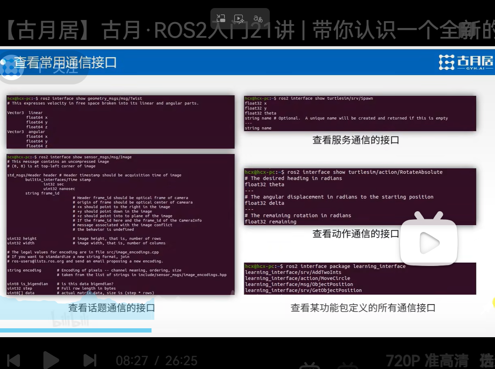
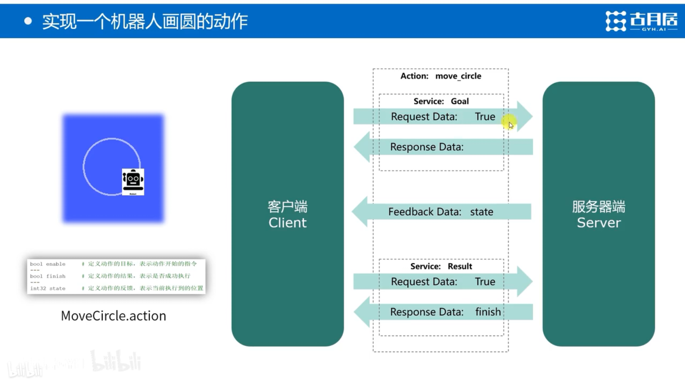

# 
DAY 6
**记录者：江栩**
**记录时间：2026.7.18** 
- [x] 概念梳理
- [x] 通信接口
- [x] action动作
## 一.学习内容
### 1.1 ROS2 核心名词总结
### 基础概念
| 名词 | 性质 | 作用 |
|------|------|------|
| **Node（节点）** | 运行单元 | 一个独立程序，完成一个功能 |
| **Topic（话题）** | 通信方式 | 发布/订阅，单向持续流 |
| **Service（服务）** | 通信方式 | 请求/响应，一问一答 |
| **Action（动作）** | 通信方式 | 长时间任务，可反馈、可取消 |
| **Message（消息）** | 数据格式 | Topic 传输的数据结构 |
| **Parameter（参数）** | 配置存储 | 节点的全局配置值 |
---
### 文件类型
| 文件 | 用途 | 类比 |
|------|------|------|
| **.msg** | 定义 Topic 消息格式 | C 的 struct |
| **.srv** | 定义 Service 请求/响应 | 函数签名 |
| **.action** | 定义 Action 目标/反馈/结果 | 任务合同 |
| **CMakeLists.txt** | 编译配置 | Makefile |
| **package.xml** | 包依赖声明 | 依赖清单 |
---
### 常用命令
| 命令 | 作用 |
|------|------|
| `ros2 node list` | 查看所有节点 |
| `ros2 topic list` | 查看所有话题 |
| `ros2 topic echo /xxx` | 查看话题数据 |
| `ros2 topic pub /xxx` | 发布话题数据 |
| `ros2 service list` | 查看所有服务 |
| `ros2 service call` | 调用服务 |
| `ros2 run pkg node` | 运行节点 |
---
### 通信模式对比
| 模式 | 方向 | 特点 | 适用场景 |
|------|------|------|---------|
| Topic | 一对多 | 持续、异步 | 传感器数据流 |
| Service | 一对一 | 同步、有返回 | 查询、计算 |
| Action | 一对一 | 长时间、可取消 | 导航、抓取 |
---
### 构建工具
| 工具 | 作用 |
|------|------|
| **colcon** | ROS2 构建工具（替代 catkin_make） |
| **ament_cmake** | C++ 包的构建系统 |
| **ament_python** | Python 包的构建系统 |
| **workspace** | 工作空间，放你的代码包 |
---
### 一句话记忆
- **Node** = 干活的程序
- **Topic** = 广播消息
- **Service** = 打电话问
- **Action** = 派长任务
- **.msg/.srv** = 数据格式合同 
### 1.2 通信接口
概念：
> 接口=两个节点之间对时用的数据格式规范
 
|通信|对应文件|规范|
|:---|:-------:|---:|
|话题|.msg文件|规定消息的数据类型|
|服务|.srv文件|规定请求和回复的数据类型|
|动作|.action文件|规定目标+反馈+结果的数据类型||

使用通信接口的好处：
+ 跨语言：c++节点和python节点之间可以相互通信
+ 自动写代码：不用手写数据结构体

### 1.3 actiond动作 
action动作：
>动作分为：目标+反馈+结果  是由话题和服务综合构建起来
目标+结果是由服务构建
反馈是由话题构建
Action = Service 的升级版：能反馈进度、能取消、有完整的生命周期管理，专门伺候那些"跑得久、变数多"的任务。

### 二.总结与反思

今天系统地梳理了 ROS 2 的核心概念体系，终于把之前零散的知识点串成了一张完整的"地图"。最大的突破是真正理解了通信三件套的本质区别——不再是死记硬背，而是能从"数据流向"和"使用场景"的角度去判断该用什么。特别是 Action，一开始觉得抽象，后来弄明白它是"Service + Topic 的组合封装"，一下子就通透了。
另外，通过自己动手解决虚拟机磁盘爆满的问题（从排查 → VMware 扩容 → 分区调整 → 文件系统扩展），不仅救活了开发环境，还对 Linux 的磁盘管理有了实战经验。理论和实操在同一天推进，感觉很充实。

+  遇到的困难与卡点
磁盘扩容踩了不少坑：一开始不理解 VMware 里"扩展"按钮为什么是灰的，后来查资料才知道精简置备模式的限制，最后靠命令行 vmware-vdiskmanager解决。说明对虚拟化底层原理还不够熟悉，遇到问题容易慌。
Action 的底层机制一开始绕不过来：5 个 Topic 封装成一个 Action，这个概念比较烧脑，需要反复类比才能消化。
对接口文件（.msg/.srv/.action）和实际代码的关系还不够直观：知道它们定义了什么，但还没亲手写过节点代码去使用它们，停留在"纸上谈兵"阶段。

* 改进方向
明天开始动手写节点代码，把今天的理论全部落地验证——光看懂不算懂，跑起来才算数。
遇到卡点时先画数据流图，不要急着搜答案，训练自己从原理推导的能力。
 * *明日计划*
从写一个最简单的 Python Publisher/Subscriber 开始，逐步过渡到自定义消息、Service、Action，最终能用 Launch 文件串联多个节点。目标：让第一个自己写的节点在终端里跑起来。